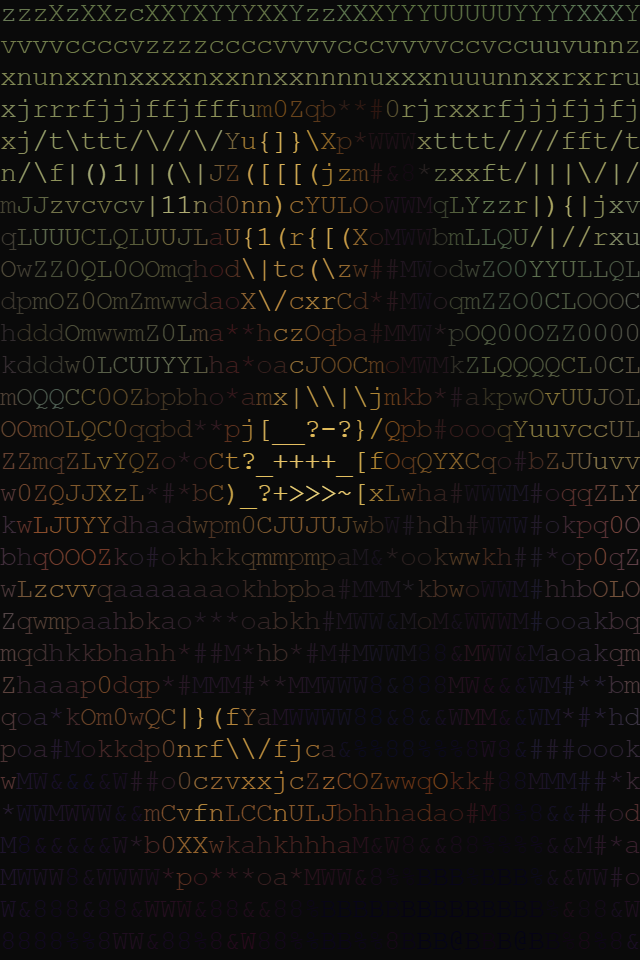

# ascii-generator

A browser-based tool for turning images, video files, and live webcam feeds into colored ASCII art. Single `index.html`, no build step, vanilla JS.

## Examples

<div align="left">
  
</div>
<div align="left">
  
</div>
<div align="left">
  
</div>

## Features

- **Image, webcam, and video modes** — drop a file or grant camera access; live modes render at ~30fps
- **Color** — per-character RGB sampled from the source pixel, or grayscale if disabled
- **Four character ramps** — Paul Bourke's 70-char standard, plus simple, Unicode blocks, and binary
- **Edge overlay** — Sobel-based edge detection that augments the ramp rather than replacing it, producing a shaded-sketch look
- **Invert** — flip the ramp for dark-on-light terminals or stylistic choice
- **Width** — 40–300 columns; live modes capped at 150 for performance
- **Copy** — grab the output as plain text
- **Save** — export a PNG of the current frame
- **Share** — settings sync to the URL hash; share the link to reproduce any configuration

## Running

Open `index.html` directly for image mode and URL sharing. For webcam, video files, and clipboard access, serve over `http://localhost` — `file://` blocks these APIs:

```bash
python3 -m http.server 8000
# then visit http://localhost:8000
```

